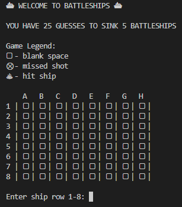
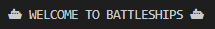
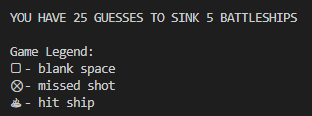
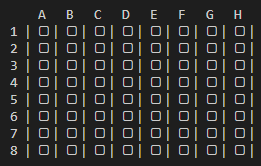
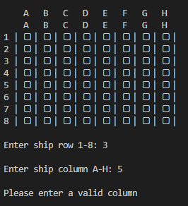

# Battleships 

(Developer: Sharj Ahmed)

[Live Webpage]()



Battleships is a classic game.

This is a python version I created. The player must try and guess where the randomly placed ships are by choosing coordinates.

If the player guesses a coordinate where a ship is placed, that ship is sunk!

The aim of the game is to sink all of the 5 ships placed randomly by the computer, within 25 guess, or shots! 

A great little game to kill a few minutes when you're bored.

Can you beat the computer and sink all the ships before your turns run out? Choose your first coordinate and find out! 

## Table of contents
* [Project Goals](#project-goals)
* [User Experience](#user-experience)
* [Features](#features)
* [Technologies](#technologies)
* [Testing](#testing)
* [Validator Testing](#validator-testing)
* [Deployment](#deployment)
* [Credits](#credits)

## Project Goals
* User Goals
    * play a fun game of Battleships.
    * Check the status of the game board as they play.
    * Easily choose their options to play against the computer.
* Site Owner Goals
    * Make it easy for the player to understand how to play the game.
    * Make the scores easily visible to the player.
    * End the game either when all 5 ships are hit or when all 25 turns have been used up.
    * Make the gameplay experience fun and challenging to encourage revisits to the game. 

## User Experience
* Target Audience
    * This game is designed for anyone looking for a fun time passer.
    * Designed to keep all ages engaged.
* User Requirements and Expectations
    * A simple gameplay experience
    * The ability to choose the coordinates for their shot.
    * Game board that is easily visible when playing.

## User Stories
* First-time Player
    1. As a first-time player, I want to be able to easily play a game of Battleships.
    2. As a first-time player, I want to understand how to play the game.
    3. As a first-time player, I want to be able to check the game board as I am playing the game.
* Returning Player
    1. As a returning player, I want to be able to play the game with as much enjoyment as the initial visit.
    2. As a returning player, I want to be able to re-check the rules. 
* Site Owner
    1. As the site owner, I want to be able to make it clear how to play, and how to check the rules.
    2. As the site owner, I want to make it clear what the progress is and who has won the game. 
        
   
## Features
* Title Area
    * I wanted to keep the title area clean and simple, but not boring. So I added the ship emoticons on either side.



* Game Criteria
    * I wanted to state the criteria on how to beat the game early on, before the player starts playing, so that they have an understanding of what needs to be done to win.



* Game Board
    * I wanted the board to be visible after every round and to be easy to understand.
    * I decided to lable each axis with numbers (1-8) for the rows and letters (A-H) for the columns.



* Gameplay
    * The player is asked to enter a row and column to play their shot
    * If an invalid character is entered, then they are met with a message to input a valid row/column




## Technologies
The project is created with:
* Languages
    * Python

* Libraries Used 
    * [Git](https://git-scm.com/)
        * Git was used for version control by utilizing the Gitpod terminal to commit to Git and Push to GitHub.
    * [GitHub](https://github.com/):
        * GitHub was used to store the project's code after being pushed from Git.
    * [Heroku](https://www.heroku.com)
        * Heroku was used to delpoy the project to a Python terminal.

## Testing
* Browser Testing:
    * The site has been tested in the following browsers:
        * Google Chrome
        * Mozilla Firefox
        * Microsoft Edge

## Validator Testing
* Validator testing was done to ensure there are no syntax errors with the code:
    * PEP8
        * State if any errors were found


### Testing User Stories from User Experience Section
1. First-Time Player Goals:
    * 

2. Returning Player Goals:
    * 

3. Site Owner:
    * 
### Bugs
* Solved bugs
    * When testing game I realised that when the player guesses a space they have already guessed, the function did not work.
    * After investigating further, I realised that there was a space in the function that should not have been there after "⊗ " - corrected to "⊗" - this solved the issue
* Unfixed bugs
    * 


## Deployment

* This project was deployed using Code Institute's mock terminal for Heroku.

 * Steps for deployment:
     * Fork or clone this repository
     * Create a new Heroku app
     * Set the build-backs to ```Python``` and ```NodeJS``` in that order
     * Link the Heroku app to the repository
     * Click on **Deploy**
    
## Credits 

* 